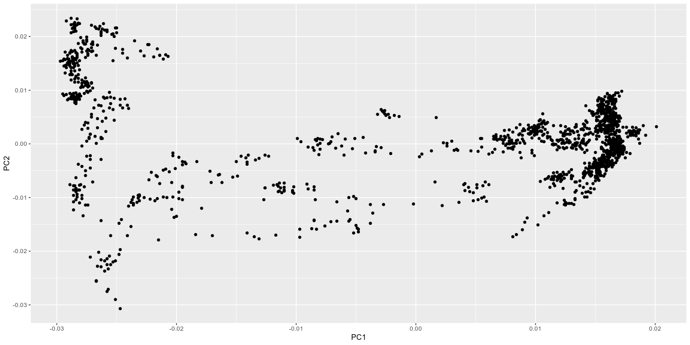
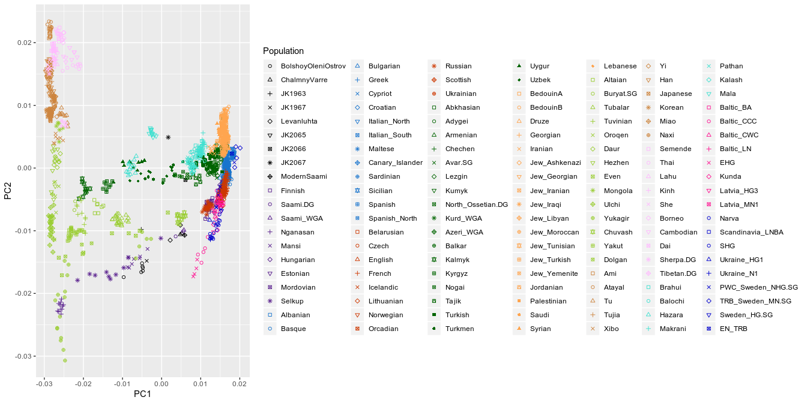
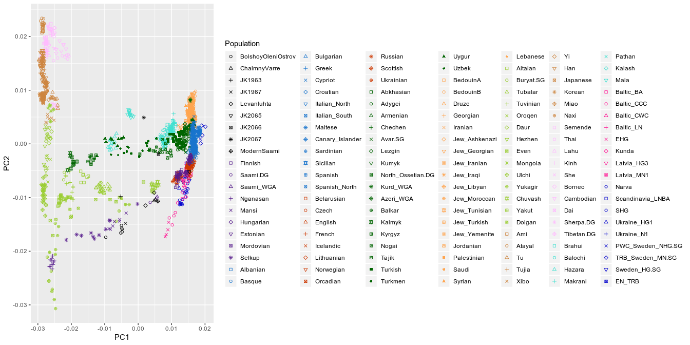
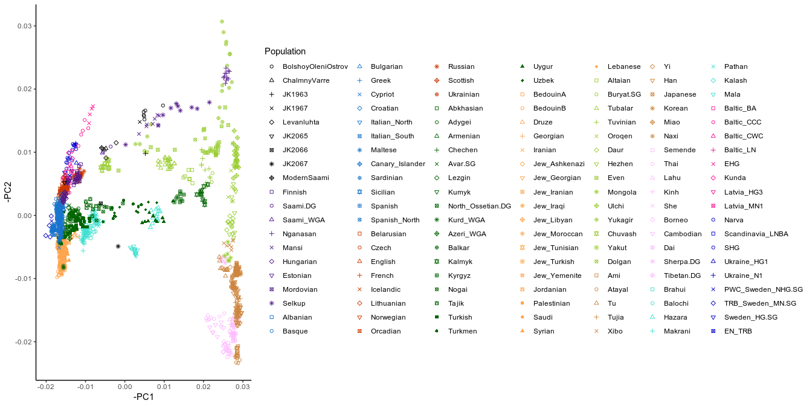
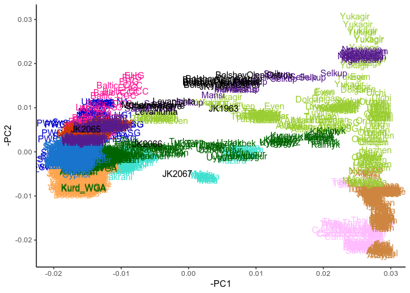
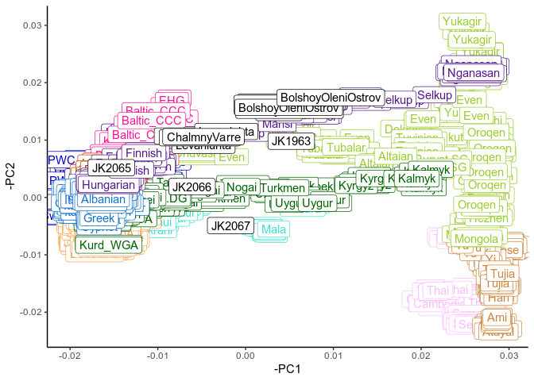
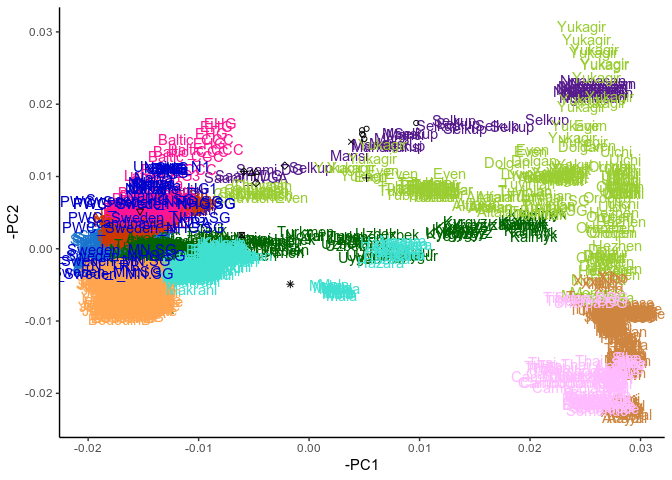
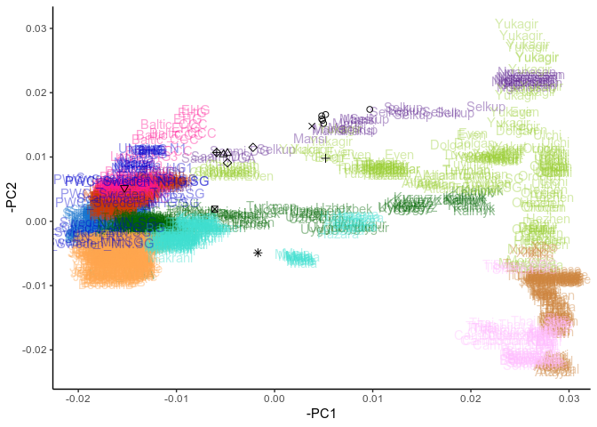

Tutorial: (Ancient) Population Genetics PCA Plotting in R and Tidyverse
================
James A. Fellows Yates (<jfy133@gmail.com>)
March 2019

-   [Introduction](#introduction)
-   [Library Loading](#library-loading)
-   [Data Loading](#data-loading)
-   [Data Cleaning](#data-cleaning)
    -   [Combining Data](#combining-data)
    -   [Ordering Populations](#ordering-populations)
    -   [Custom Aesthetic Data](#custom-aesthetic-data)
-   [Plotting with points](#plotting-with-points)
    -   [Blank Canvas](#blank-canvas)
    -   [Point Layer](#point-layer)
    -   [Colouring](#colouring)
    -   [Point Shapes](#point-shapes)
    -   [Points Of Interest On Top?](#points-of-interest-on-top)
    -   [Reversing Axes](#reversing-axes)
    -   [Reducing Ink](#reducing-ink)
    -   [Fixing Large Legends](#fixing-large-legends)
-   [My legends are still to large! Text instead of points?](#my-legends-are-still-to-large-text-instead-of-points)
    -   [With `geom_text()`](#with-geom_text)
    -   [With `geom_label()`](#with-geom_label)
    -   [Fixing overplotting](#fixing-overplotting)
-   [Now over to you!](#now-over-to-you)

Introduction
------------

This notebook explains how to make a PCA scatter plot typically used in ancient human population genetics in R, using the `tidyverse` collection of packages. The notebook is aimed at those who are pretty new to R, but have a basic knowledge of how things work (e.g. how to assign a variable, a general idea of what a vector is).

The challenge in this type of plot is that you often have many different populations which you want to distinguish between - typically by colours. But on top of this, in aDNA studies, you want to distinguish between modern and ancient individuals - such as by point shape - and emphasise these ancient or new populations over the modern reference dataset.

> In particular, people who try this themselves get stuck when making a nice legend, as the popular plotting package ggplot2 prefers to make a legend for colours and shapes separately - which can take up a lot of space.

Here I aim to gently introduce some basic tools and procedures to prepare data for plotting using `tidyverse` functions, and then how to step by step build a final PCA plot in ggplot2, which can be used for presentation.

Why tidyverse? All the packages in this collection follow very strict rules on how functions should work and be design. The overall aim is to make R code much more readable and intuitive to both coders and users.

<a rel="license" href="http://creativecommons.org/licenses/by-sa/4.0/"></a><br />This work is licensed under a <a rel="license" href="http://creativecommons.org/licenses/by-sa/4.0/">Creative Commons Attribution-ShareAlike 4.0 International License</a>.

Library Loading
---------------

Firstly we need to load the packages that contain the functionality we want to utilise for loading data, manipulating data and finally plotting.

We will use the following libraries from the `tidyverse` collection of packages.

``` r
library(readr) ## For loading files
library(tibble) ## For a 'tidy' data frame or table format
library(dplyr) ## For data manipulation
```

    ## 
    ## Attaching package: 'dplyr'

    ## The following objects are masked from 'package:stats':
    ## 
    ##     filter, lag

    ## The following objects are masked from 'package:base':
    ## 
    ##     intersect, setdiff, setequal, union

``` r
library(forcats) ## For further data manipulation 
library(ggplot2) ## For plotting
```

Data Loading
------------

For this notebook, we are going to use data from Figure 2a of Lamnidis *et al*. (2018) *Nature Communications* doi: [10.1038/s41467-018-07483-5](https://doi.org/10.1038/s41467-018-07483-5) (Open Access).

I have already downloaded and cleaned the supplementary data for Figure 2a for you (from the 'Source Data' file from the link above), and have stored them in this repository in two files:

-   The PCA data itself. This has a column for the Individual, the values for PC1, PC2, PC3, PC4, and the population the indiviual is from.
-   The 'aesthetics' (i.e. colour and shape) that Lamnidis *et al.* chose for their populations in their PCA. I have modified the columns to `R` colour and `shape` IDs rather than datagraph format.

We first will load the files into our `R` session using the `read_csv()` function from the `readr` package.

``` r
data_pca <- read_csv("data/PCA_Data_Lamnidis2018NatComms_Figure2a.csv")
```

    ## Parsed with column specification:
    ## cols(
    ##   Individual = col_character(),
    ##   PC1 = col_double(),
    ##   PC2 = col_double(),
    ##   PC3 = col_double(),
    ##   PC4 = col_double(),
    ##   Population = col_character()
    ## )

``` r
data_meta <- read_csv("data/PCA_Aesthetics_Lamnidis2018NatComms_Figure2a.csv")
```

    ## Parsed with column specification:
    ## cols(
    ##   Population = col_character(),
    ##   colorNr = col_character(),
    ##   symbolNr = col_double()
    ## )

A nice thing about the `read_csv()` function is that it by default loads the data into a `tibble` (the `tidyverse` version of a data frame). This tidy version of a dataframe has a nifty functionality where if you print a tibble, rather than displaying the entire dataframe (as in base `R`), it displays enough columns and rows that fits into your console (maximum of 10 rows), any additional columns are displayed in a list below this 'preview'. Furthermore, the preview will display extra information about the dataframe (e.g. total number rows) and each column type (e.g. whether a column has numeric or character data).

We can try this now here on each tibble separately.

``` r
data_pca
```

    ## # A tibble: 1,466 x 6
    ##    Individual      PC1     PC2     PC3    PC4 Population        
    ##    <chr>         <dbl>   <dbl>   <dbl>  <dbl> <chr>             
    ##  1 BOO001     -0.0052  -0.0166 -0.0032 0.0119 BolshoyOleniOstrov
    ##  2 BOO002     -0.00480 -0.0159 -0.004  0.007  BolshoyOleniOstrov
    ##  3 BOO003     -0.00480 -0.0164 -0.0042 0.0073 BolshoyOleniOstrov
    ##  4 BOO004     -0.005   -0.0152 -0.0037 0.0089 BolshoyOleniOstrov
    ##  5 BOO005     -0.0049  -0.0157 -0.0044 0.0061 BolshoyOleniOstrov
    ##  6 BOO006     -0.0097  -0.0174 -0.003  0.0171 BolshoyOleniOstrov
    ##  7 CHV001      0.0052  -0.0104 -0.005  0.0073 ChalmnyVarre      
    ##  8 CHV002      0.00480 -0.0106 -0.005  0.0053 ChalmnyVarre      
    ##  9 JK1963     -0.0052  -0.0098 -0.0032 0.0065 JK1963            
    ## 10 JK1967     -0.0038  -0.0148 -0.0039 0.0022 JK1967            
    ## # … with 1,456 more rows

``` r
data_meta
```

    ## # A tibble: 140 x 3
    ##    Population         colorNr symbolNr
    ##    <chr>              <chr>      <dbl>
    ##  1 BolshoyOleniOstrov black          1
    ##  2 ChalmnyVarre       black          2
    ##  3 JK1963             black          3
    ##  4 JK1967             black          4
    ##  5 Levanluhta         black          5
    ##  6 JK2065             black          6
    ##  7 JK2066             black          7
    ##  8 JK2067             black          8
    ##  9 ModernSaami        black          9
    ## 10 Finnish            purple4        0
    ## # … with 130 more rows

Data Cleaning
-------------

### Combining Data

In the previous section an important observation in the two tibbles is that there is a common column name: 'Population'. When you want to apply the same workflow in this notebook for your own data, you must make sure you have a similar common column (with the same formatting!).

The reason why having this common column is important is because we join the two tables together. The `left_join()` function from the `dplyr` package does this for us. It searches for common column names betweens the two, and adds the rows from the second file to the first, when the population name in the column from the first table is the same in the column in the second table.

> If you have multiple rows in your first tibble with the same population name, `left_join()` will duplicate the corresponding row in the second tibble in the sense it'll add the same information to every corresponding row in the first tibble.

Again we can check this happened correctly by printing the variable name. We should now see columns from both tibbles in the new tibble named `data_combined`.

``` r
data_combined <- left_join(data_pca, data_meta) %>% print()
```

    ## Joining, by = "Population"

    ## # A tibble: 1,466 x 8
    ##    Individual      PC1     PC2     PC3    PC4 Population   colorNr symbolNr
    ##    <chr>         <dbl>   <dbl>   <dbl>  <dbl> <chr>        <chr>      <dbl>
    ##  1 BOO001     -0.0052  -0.0166 -0.0032 0.0119 BolshoyOlen… black          1
    ##  2 BOO002     -0.00480 -0.0159 -0.004  0.007  BolshoyOlen… black          1
    ##  3 BOO003     -0.00480 -0.0164 -0.0042 0.0073 BolshoyOlen… black          1
    ##  4 BOO004     -0.005   -0.0152 -0.0037 0.0089 BolshoyOlen… black          1
    ##  5 BOO005     -0.0049  -0.0157 -0.0044 0.0061 BolshoyOlen… black          1
    ##  6 BOO006     -0.0097  -0.0174 -0.003  0.0171 BolshoyOlen… black          1
    ##  7 CHV001      0.0052  -0.0104 -0.005  0.0073 ChalmnyVarre black          2
    ##  8 CHV002      0.00480 -0.0106 -0.005  0.0053 ChalmnyVarre black          2
    ##  9 JK1963     -0.0052  -0.0098 -0.0032 0.0065 JK1963       black          3
    ## 10 JK1967     -0.0038  -0.0148 -0.0039 0.0022 JK1967       black          4
    ## # … with 1,456 more rows

Here we can see, two more tidyverse tricks:

1.  A 'pipe', indicated by `%>%`, from the `magrittr` package (included in dplyr). This works like pipes (`|`) do in the terminal, and just says the output of the first function should be passed into the first argument position of the next function. This makes code much more readable going left to right step-by-step rather than 'nesting' of functions as we normally see in R.

2.  We can simultaneously *assign* to a variable the output of a function, and print the final result by piping our join function into `print()`.

### Ordering Populations

Next we want to 'hard-code' the order of populations as they are in in our raw data. We want to do this because by default `ggplot()` will display points in alphabetical order of a particular column.

To hard code this we can convert the 'Population' column of our data from a *character* to *factor*. A factor is an object which allows you to hardcode the ordering of that list other than alphabetical order by setting your own hierarchy.

As our loaded data is already in the order we want to plot (based on population similarity), we can use a nifty function from the `forcats` package called `as_factor()` to generate our hierarchy based on the order row order that the Population column is already in.

> Note that if your two data files do not have the same order in the Population column, the `left_join()` function we applied above will take the first tibble's (or left tibble) column order as precendence over the second! Make sure both are in the same order, or try `right_join()` instead.

Again, using the tibble 'preview' functionality, we can check that the Population column type has changed from character (`chr`) to factor (`fctr`).

``` r
data_combined <- data_combined %>%
  mutate(Population = as_factor(Population)) %>%
  print()
```

    ## # A tibble: 1,466 x 8
    ##    Individual      PC1     PC2     PC3    PC4 Population   colorNr symbolNr
    ##    <chr>         <dbl>   <dbl>   <dbl>  <dbl> <fct>        <chr>      <dbl>
    ##  1 BOO001     -0.0052  -0.0166 -0.0032 0.0119 BolshoyOlen… black          1
    ##  2 BOO002     -0.00480 -0.0159 -0.004  0.007  BolshoyOlen… black          1
    ##  3 BOO003     -0.00480 -0.0164 -0.0042 0.0073 BolshoyOlen… black          1
    ##  4 BOO004     -0.005   -0.0152 -0.0037 0.0089 BolshoyOlen… black          1
    ##  5 BOO005     -0.0049  -0.0157 -0.0044 0.0061 BolshoyOlen… black          1
    ##  6 BOO006     -0.0097  -0.0174 -0.003  0.0171 BolshoyOlen… black          1
    ##  7 CHV001      0.0052  -0.0104 -0.005  0.0073 ChalmnyVarre black          2
    ##  8 CHV002      0.00480 -0.0106 -0.005  0.0053 ChalmnyVarre black          2
    ##  9 JK1963     -0.0052  -0.0098 -0.0032 0.0065 JK1963       black          3
    ## 10 JK1967     -0.0038  -0.0148 -0.0039 0.0022 JK1967       black          4
    ## # … with 1,456 more rows

which is indeed the case.

### Custom Aesthetic Data

With this dataframe, we have almost everything ready for plotting. In principle we could already plot our PCA. However, as mentioned in the introduction, we have the problem of having separate legends - one per 'aesthetic'.

To deal with this issue, we need to collect more data from some of aesthetic columns from the Aesthetic data we loaded at the beginning. These allows us to 'hard-code' our colours and shapes to exactly as we want it (rather than ggplot2 randomly assigning colours for us).

To do this we need to make a 'named' vector, i.e. a list of a named keys (the population) and a value assigned to each key (the colour or shape you want that population to have). For example: `key1 = "value1", key2 = "value2"`

We do this by selecting the Population and colorNr columns only using `dplyr`'s `select()` function, then 'remove' the table-shape of the data into just a vector by using the `tibble` function `deframe()`. The result of `deframe()` is that each row of column 2 is an entry (or value) in the vector, and each entry has a 'name' assigned to it as defined in the same row in column 1.

``` r
list_colour <- data_combined %>% 
  select(Population, colorNr) %>% 
  deframe()

list_shape <- data_combined %>% 
  select(Population, symbolNr) %>% 
  deframe()

head(list_colour) 
```

    ## BolshoyOleniOstrov BolshoyOleniOstrov BolshoyOleniOstrov 
    ##            "black"            "black"            "black" 
    ## BolshoyOleniOstrov BolshoyOleniOstrov BolshoyOleniOstrov 
    ##            "black"            "black"            "black"

> Note here I didn't use `print()`. This is because a named vector is a base R object, so using `print()` it would end up printing the entire contents of the object to screen. `head()` will only print the first few entries of any object.

Plotting with points
--------------------

So onto the plot itself. Following the [layered grammar of graphics](https://vita.had.co.nz/papers/layered-grammar.html) principles which the `ggplot2` package is based on, we will build our figures in the form of multiple layers that overlay each other.

### Blank Canvas

The first step is to provide the basic data that will inform the various components of the plot. Then we specify the specific 'aesthetics' of the plot by supplying the columns that will inform the X and Y coordinates of each data point, what column we want to colour the points by, and so on to the `aes()` function.

``` r
ggplot(data = data_combined, 
       aes(x = PC1, y = PC2))
```


As you can see here, we now have generated a blank 'canvas'. Our columns have defined our X and Y axis, but not much else. This is because we need to specify in what form the data should be plotted as.

### Point Layer

For a PCA, we can do this with `geom_point()` which will use our X and Y columns to specify on which coordinates along our two axis each point (or individual) should be.

``` r
ggplot(data = data_combined %>% arrange(desc(Population)), 
       aes(x = PC1, y = PC2)) +
  geom_point()
```



### Colouring

However, we currently cannot distinguish between each point. To colour each point per it's associated population, we need to add an additional aesthetic variable to `aes()`, which is `colour` - and accordingly which column of our data should inform how the different colours should be distributed.

``` r
ggplot(data = data_combined, 
       aes(x = PC1, y = PC2, colour = Population)) +
  geom_point()
```


> Note that the legend is ordered by the levels in the Population column - as hard coded by our `as_factor()` function we applied above - and not alphabetical order as it would be if the column was just of the type character.

Now each population has it's own colour. However, in the original plot from Lamnidis *et al*., populations were grouped together by similarity with the groupings indicated by different colour.

As you remember from our original data, we have a column that specifically specifies our colours (colorNr), which we then [converted to a named vector](#custom-aesthetic-data). We can use this to manually set the colour of each population by adding a `scale_colour_manual()` layer to our plot.

This function, given a named vector, will look at the Column that we defined in the `geom_point()` colour variable within `aes()`, and set the colour of each Population in that column to the colour defined in the named vector that has the same Population name.

``` r
ggplot(data = data_combined, 
       aes(x = PC1, y = PC2, colour = Population)) + 
  scale_colour_manual(values = list_colour) + 
  geom_point()
```


### Point Shapes

The same principle can be applied to the shape aesthetic. We just need to add which column should inform the shape variable in `aes()` (again Population), and add a `scale_shape_manual()` function to our plot but instead using the named vector `list_shape` we made earlier.

``` r
ggplot(data = data_combined, 
       aes(x = PC1, y = PC2, colour = Population, shape = Population)) + 
  scale_colour_manual(values = list_colour) + 
  scale_shape_manual(values = list_shape) + 
  geom_point()
```



### Points Of Interest On Top?

Unfortunately, in our Population column, we had the new individuals from the Lamnidis *et al.* study as the first few populations in the data. This then means that these individuals would be plotted first and end up underneath other populations, despite being the ones we would like to emphasise the most. You can see this with JK1963 (the black asterisk) falling beneath one of the green points near the centre of the plot.

We can simply fix this by arranging the Population column in our data in reverse order. This will then cause the last Populations in the tibble to be printed first, and the ones at the top of the original data (the individuals of interest) first.

> Remember that factors, not character columns, are what allow you to set the ordering of the way things are plotted. Character columns will always follow either alphabetical or numeric ordering regardless of the way you arrange your data.

We will use two functions from the `dplyr` package to re-order the base data of the plot. The first is `arrange()`, which will order the supplied column in ascending order i.e. by A-Z alphabeticalorder (for character columns) or the original order displayed in the column (for factors). We want in this case to do the reverse, as we want the new Lamnidis *et al*. individals to be at the bottom of our data tibble (so displayed last). So we additionally wrap the column in `desc()` to arrange in descending order (so Z-A or from last to first, accordingly).

``` r
ggplot(data = data_combined %>% arrange(desc(Population)), 
       aes(x = PC1, y = PC2, colour = Population, shape = Population)) + 
  scale_colour_manual(values = list_colour) + 
  scale_shape_manual(values = list_shape) + 
  geom_point()
```



Now, we should see that the new individuals, in black, are printed last and thus on top of every other population. A nice thing is that the legend itself retains the original Population factor order (i.e. with the new individuals displayed first).

> Due to the fine grained control of `ggplot2`, we can of course reverse the order of the legend, by customising the legend itself. However we will leave this out for this notebook.

### Reversing Axes

You may notice now we are getting close to recreating the original plot from Lamnidis *et al*.. One issue is that the ordination of the points, are flipped compared to the original plot - i.e. not in the classic 'PC orientation matches cardinal directions'.

We can correct this in a similar fashion to how we re-ordered the way the plots are displayed, by flipping the sign of the column's contents. As the issue stems from the fact the PCA algorthims randomly pick the postive or negative direction in each PC, we can convert negative values to positive and positive to negative by taking the negative of the *column itself* (thus flipping the sign of all values). E.g. if we change `PC1` to `-PC1`, we should see a `-1` point on the X axis becoming `1` and vice versa.

``` r
ggplot(data = data_combined %>% arrange(desc(Population)), 
       aes(x = -PC1, y = -PC2, colour = Population, shape = Population)) + 
  geom_point() +
  scale_colour_manual(values = list_colour) + 
  scale_shape_manual(values = list_shape)
```


### Reducing Ink

A major inspiration for modern figure design is from [Edward Tufte](https://en.wikipedia.org/wiki/Edward_Tufte#Information_design) who has an overriding principle of 'minimising ink'. In the old days of printed material this saved resources and money, but also has an additional benefit of making sure to minimise as much distraction away from the data as possible.

`ggplot2` provides a few additional 'global themes' along these lines. The closest one to the Lamnidis *et al*. paper is `theme_classic()`, which we can add as an extra aesthetic layer (although your remember your personal customisations retain precendence over this).

``` r
ggplot(data = data_combined %>% arrange(desc(Population)), 
       aes(x = -PC1, y = -PC2, colour = Population, shape = Population)) + 
  geom_point() +
  scale_colour_manual(values = list_colour) + 
  scale_shape_manual(values = list_shape) +
  theme_classic()
```



### Fixing Large Legends

At the moment, the PCA looks a little cramped because the legend is so large. We can improve this by decreasing the number of columns the legend has and reducing the font size.

Legends are known as 'guides' in `ggplot2`, so we can add another layer called `guides()` to indicate we want to customise this particular aspect of the plot. Within this layer, we don't need to use `aes()` as we don't want to customise by data columns themselves, but rather a user specified customisation that applies to every data point.

The next part is a bit complicated but bare with me.

Within `guides()` we firstly need to specify which legend we want to customise. As we've actually 'collapsed' the two legends we would normally have: one for colour and one for shapes (as they use the same column), we can just pick the `colour` aesthetic variable.

Within here we use a second function called `guide_legends()`, which is used to translate the customisation within the function to *just* to ones that are valid to legends. Here we specify we want 6 columns in the legend.

We also want to make the population labels in the legend smaller. For this we need to specify `label.theme()` so we customise only that aspect of the legend. We also need to use customisations that apply only to test, for this we use `element_text()` and set the size variable to the smaller font size.

``` r
ggplot(data_combined %>% arrange(desc(Population)), 
       aes(-PC1, -PC2, colour = Population, shape = Population)) + 
  geom_point() + 
  scale_colour_manual(values = list_colour) + 
  scale_shape_manual(values = list_shape) +
  guides(colour = guide_legend(ncol = 6, label.theme = element_text(size = 7))) +
  theme_classic()
```


Now we have a much more equal plot to legend ratio.

My legends are still to large! Text instead of points?
------------------------------------------------------

Now you may be thinking this is nice, except the legend is still way too big and takes up too much space e.g. when publishing in a journal article, report or thesis.

### With `geom_text()`

Instead, we could try and collapse the information of the coordinates on the PCA and the populations together by replacing the points on the PCA with the population actual names of the population each individual belongs to.

This requires a few minor changes to our code, however following the same concepts as before.

There are a few things we need to do: 1. Replace the `shape =` aesthetic (as we won't be using points anymore) to the `label =` varible. 2. Replace our `geom_point()` layer with `geom_text()` 3. Remove our `scale_shape_manual()` layer (as we aren't using the points) 4. Turn off the legend by removing `guides()`, and adding a new layer `theme()` at the end, and setting the variable `legend.position` to `"none"`. Note that `theme()` is a 'global' layer and applies to all legends, unlike `guides()` which allowed customisation of each particular legend.

``` r
ggplot(data_combined %>% arrange(desc(Population)), 
       aes(-PC1, -PC2, colour = Population, label = Population)) + 
  geom_text() + 
  scale_colour_manual(values = list_colour) + 
  theme_classic() +
  theme(legend.position = "none")
```



> Here I have just used the whole population name as recorded in the data and aesthetic files. It is common in population genetics to use three letter codes instead. We can easily apply the same thing here by adding a new column e.g. "Code" to the "aesthetics" input file we loaded at the beginning with the three letter codes, and changing the `colour` and `label` variable in `ggplot()` from "Population" to "Code"

### With `geom_label()`

This still isn't as clear as there is a lot of text and they are overlapping eachother into oblivion in some places. As an alternative, we can try using `geom_label()` instead of the `geom_text()` layer.

``` r
ggplot(data_combined %>% arrange(desc(Population)), 
       aes(-PC1, -PC2, colour = Population, label = Population)) + 
  geom_label() + 
  scale_colour_manual(values = list_colour) + 
  theme_classic() +
  theme(legend.position = "none")
```



### Fixing overplotting

This is better as we can read the text, but we still have a lot of overlapping points.

One final option we have is make two layers, one text for the background points, and then another layer of points for the new individuals. This way we can see at fine resolution where the new individuals fall, but on top of the general population it falls in.

This requires a slightly more complex procedure, as we don't want to plot the new individuals with `geom_text()` at the same time as the comparative populations - as we won't be able to see the black points in the overplotted labels of those individuals.

#### Extra data manipulation

Therefore, we need to supply 'filtered' data to both layers, and apply the aesthetics to each layer independently.

For filtering, we need to make a record of the new populations which we want to plot on the new layer. We can record these in a vector:

``` r
new_pops <- c("BolshoyOleniOstrov", "ChalmnyVarre", "JK1963", "JK1967", 
              "Levanluhta", "JK2065", "JK2066", "JK2067", "ModernSaami")
```

Next, we need to split our data into two: one for the background, one for the foreground - using our new vector within `dlpyr`'s `filter()` function in combination with the conditional expression function `%in%`.

The way this works is :

1.  we pipe our data into `filter()`
2.  Say which column of our data we want to apply the filter on.
3.  Say how we want to filter. In the first case, we want to find any row in our filtering column that matches any entry `%in%` our vector.
4.  Print the resulting tibble to check we see have only those individuals

``` r
data_foreground <- data_combined %>% 
  filter(Population %in% new_pops) %>% 
  print()
```

    ## # A tibble: 16 x 8
    ##    Individual      PC1     PC2     PC3     PC4 Population  colorNr symbolNr
    ##    <chr>         <dbl>   <dbl>   <dbl>   <dbl> <fct>       <chr>      <dbl>
    ##  1 BOO001     -0.0052  -0.0166 -0.0032  0.0119 BolshoyOle… black          1
    ##  2 BOO002     -0.00480 -0.0159 -0.004   0.007  BolshoyOle… black          1
    ##  3 BOO003     -0.00480 -0.0164 -0.0042  0.0073 BolshoyOle… black          1
    ##  4 BOO004     -0.005   -0.0152 -0.0037  0.0089 BolshoyOle… black          1
    ##  5 BOO005     -0.0049  -0.0157 -0.0044  0.0061 BolshoyOle… black          1
    ##  6 BOO006     -0.0097  -0.0174 -0.003   0.0171 BolshoyOle… black          1
    ##  7 CHV001      0.0052  -0.0104 -0.005   0.0073 ChalmnyVar… black          2
    ##  8 CHV002      0.00480 -0.0106 -0.005   0.0053 ChalmnyVar… black          2
    ##  9 JK1963     -0.0052  -0.0098 -0.0032  0.0065 JK1963      black          3
    ## 10 JK1967     -0.0038  -0.0148 -0.0039  0.0022 JK1967      black          4
    ## 11 JK1968      0.00480 -0.0091 -0.0047  0.0036 Levanluhta  black          5
    ## 12 JK1970      0.0022  -0.0115 -0.0042  0.0094 Levanluhta  black          5
    ## 13 JK2065      0.0153  -0.0052 -0.0056 -0.0043 JK2065      black          6
    ## 14 JK2066      0.0061  -0.0019 -0.0042  0.0042 JK2066      black          7
    ## 15 JK2067      0.0017   0.0049 -0.0037  0.0347 JK2067      black          8
    ## 16 Saami001    0.0059  -0.0107 -0.0063  0.0078 ModernSaami black          9

And as expected, we see we now only have 16 rows in this new `tibble`.

Next we want to do the same filtering but this time inverted - i.e. keep everything that is *not* the new individuals. For this we can just add `!` to the beginning of the expression.

``` r
data_background <- data_combined %>% 
  filter(!Population %in% new_pops) %>% 
  print()
```

    ## # A tibble: 1,450 x 8
    ##    Individual     PC1      PC2     PC3      PC4 Population colorNr symbolNr
    ##    <chr>        <dbl>    <dbl>   <dbl>    <dbl> <fct>      <chr>      <dbl>
    ##  1 HG00171     0.0112 -0.0081  -0.0066  6.00e-4 Finnish    purple4        0
    ##  2 HG00174     0.0131 -0.006   -0.0057 -2.40e-3 Finnish    purple4        0
    ##  3 HG00190     0.0128 -0.0053  -0.0059 -1.00e-4 Finnish    purple4        0
    ##  4 HG00266     0.0122 -0.0067  -0.0059 -1.60e-3 Finnish    purple4        0
    ##  5 HG00183     0.0115 -0.0067  -0.0056 -8.00e-4 Finnish    purple4        0
    ##  6 HG00173     0.0121 -0.007   -0.0063 -1.20e-3 Finnish    purple4        0
    ##  7 HG00181     0.013  -0.00480 -0.004   1.00e-3 Finnish    purple4        0
    ##  8 HG00182     0.0116 -0.0078  -0.0059  1.00e-4 Finnish    purple4        0
    ##  9 S_Saami-1.… 0.0055 -0.0101  -0.0056  3.80e-3 Saami.DG   purple4        1
    ## 10 S_Saami-2.… 0.0036 -0.0109  -0.0051  9.30e-3 Saami.DG   purple4        1
    ## # … with 1,440 more rows

#### Plotting two layers

Back with `ggplot2` we can plot the two layers independently by moving the new sets of input data from the `ggplot` function to the `geom_*` layers (leaving `ggplot()` empty), along with their corresponding aesthetics (which we borrow from above - such as `scale_shape_manual()`).

``` r
ggplot() + 
  geom_text(data = data_background, aes(x = -PC1, y = -PC2, colour = Population, label = Population)) + 
  geom_point(data = data_foreground, aes(x = -PC1, y = -PC2, colour = Population, shape = Population)) +
  scale_colour_manual(values = list_colour) + 
  scale_shape_manual(values = list_shape) +
  theme_classic() +
  theme(legend.position = "none")
```



This is getting slightly better, however it's still a bit difficult to see the points over the populatons. We can improve on this by reducing the 'strength' of the colours of the background populations, but also make the points of our new individuals bigger.

For the former, we can add an extra variable to the `geom_text()` layer called `alpha` which sets a transparency level to the text. In this case we will *not* put this within `aes()`, as we don't want the data to inform level of transparency, but rather we want to hard code this to apply to all populations.

``` r
ggplot() + 
  geom_text(data = data_background, 
            aes(x = -PC1, y = -PC2, colour = Population, label = Population), 
            alpha = 0.4) + 
  geom_point(data = data_foreground, 
             aes(x = -PC1, y = -PC2, colour = Population, shape = Population)) +
  scale_colour_manual(values = list_colour) + 
  scale_shape_manual(values = list_shape) +
  theme_classic() +
  theme(legend.position = "none")
```


Now we will change the `size` of the points within the `geom_point()` layer, again *outside* the aeshetics as we want to hard code this to apply to all points.

``` r
ggplot() + 
  geom_text(data = data_background, 
            aes(x = -PC1, y = -PC2, colour = Population, label = Population), 
            alpha = 0.4) + 
  geom_point(data = data_foreground, 
             aes(x = -PC1, y = -PC2, colour = Population, shape = Population), 
             size = 2) +
  scale_colour_manual(values = list_colour) + 
  scale_shape_manual(values = list_shape) +
  theme_classic() +
  theme(legend.position = "none")
```



We can also improve the points visibility by making the lines of the shapes thicker by increasing the `stroke` variable.

``` r
ggplot() + 
  geom_text(data = data_background, 
            aes(x = -PC1, y = -PC2, colour = Population, label = Population), 
            alpha = 0.4) + 
  geom_point(data = data_foreground, 
             aes(x = -PC1, y = -PC2, colour = Population, shape = Population), 
             size = 2, stroke = 0.7) +
  scale_colour_manual(values = list_colour) + 
  scale_shape_manual(values = list_shape) +
  theme_classic() +
  theme(legend.position = "none")
```


Finally, while we can (sort of) see the names of the reference populations, we have no idea which populations the points of the new individuals refer to. For this we can add the legend back in (as it's comparatively few populations compared to the comparative data), however we need to make sure we only show the legend for the `geom_point()` layer.

We can remove the `theme()` layer because it was a 'global' layer and we want to now tweak different legends, and replace it with `guides()` again.

``` r
ggplot() + 
  geom_text(data = data_background, 
            aes(x = -PC1, y = -PC2, colour = Population, label = Population), 
            alpha = 0.4) + 
  geom_point(data = data_foreground, 
             aes(x = -PC1, y = -PC2, colour = Population, shape = Population), 
             size = 2, stroke = 0.7) +
  scale_colour_manual(values = list_colour) + 
  scale_shape_manual(values = list_shape) +
  theme_classic() +
  guides(color = FALSE, size = FALSE)
```


Now over to you!
----------------

The steps above are generally applicable to most scatter-plot like data, thus in principle if you open this notebook in Rstudio yourself, and change each code block to your own specifications - whether changing the order of the axes, or instead plotting PC2 and PC3 - you will generate a nice clear plot as above, but with your data instead.

The main thing to remember is that your input data that you load into the R session should have your Population column in the order you want the points to be displayed in. Otherwise, just compare your input data to the ones included in this repository and follow the same formatting of the data.

If you have any further questions or functionality you wish to add to the notebook, let me know and I'll update it accordingly.

Futhermore, if there is anything that doesn't make sense I am more than willing to re-phrase or add additional explanations.
